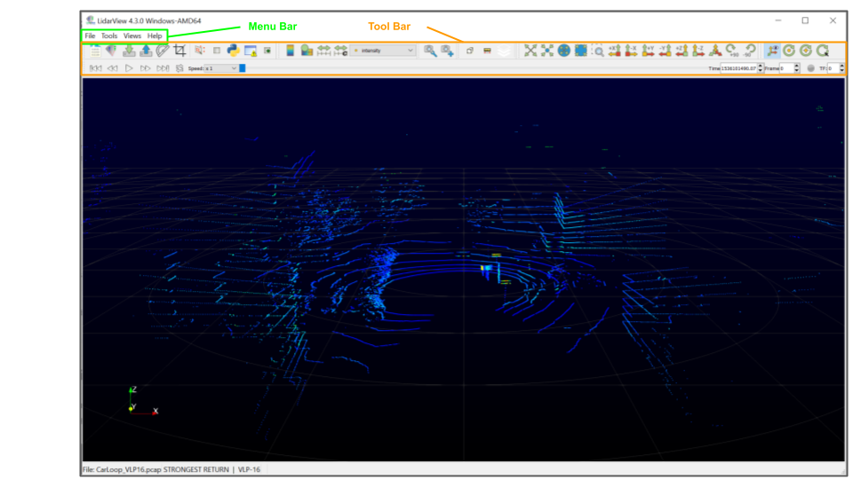
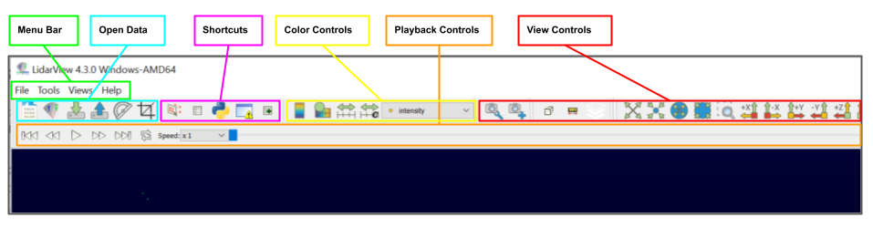
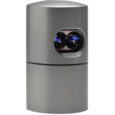

.. _chapter:BasicUsage:

Basic Usage
###########

Let us get started using **LidarView**. In order to follow along, you will
need your own installation of **LidarView**. If you do not already have **LidarView**,
you can download the current release of LidarView_.
**LidarView** launches like most other applications. On Windows, the
launcher is located in the start menu. On Macintosh, open the
application bundle that you installed. On Linux, execute ``LidarView`` from a
command prompt (you will need to set your path to point to where you unpacked
LidarView).

User Interface
==============

The **LidarView** GUI conforms to the platform on which it is running, but on
all platforms it behaves basically the same. The layout shown here is
the default layout given when **LidarView** is first started. The GUI
includes a Menu Bar as well as a Tool Bar that give access to the various
features of the application.

Menu Bar
    This gives access to File related options like opening PCAP files and
    sensor streams, a Tools and View menu, and a general Help menu.

The Tool Bar can be broked up into several separate sections described below.

Open Data Toolbar
    This part of the toolbar includes buttons to manage opening PCAP files and
    sensor streams, loading and saving **LidarView** state files, and importing
    calibration files.

Shortcuts Toolbar
    This section of the toolbar gives quick access to the spreadsheet view and
    the python and error consoles as wells as the ability to selects points from
    the current active data.

Playback Controls
    These controls allow the user to temporally navigate the Lidar data. The
    data can be played through, advanced one frame at a time, or a specific
    time can be selected.

Color Controls
    These controls allow the user to select what data field determines how the
    point cloud is colored and adjust the color map used to represent the range
    of the selected data field.

View Controls
    These controls allow the user to set the prespective that the point cloud is
    viewed from.

Loading Data
=================

There are two ways to load Lidar sensor data into **LidarView**. You can connect
to a sensor steam or open a recorded sensor stream saved to a PCAP file. These
can both be found on the Menu Bar (File->Open) or on the Open Data Toolbar.

.. exercise:: Opening a saved sensor stream
   :label: OpenSaveSensorStream
   :class: note

    Let's start with opening a saved sensor stream file. If you don't have access
    to PCAP file with a saved sensor stream you can download an example:
    CarLoop_VLP16_. Go to the the File menu and select Open and then Capture File.
    Alternatively you can click on the the Open PCAP File button |OpenPCAP| in
    the Open Data section of the toolbar. Select the PCAP file you wish to open
    and click OK, and then select the appropriate sensor interpeter and click OK.
    You should now see the first frame of the saved sensor data displayed in the
    main render view.

.. exercise:: Connecting to a sensor stream
   :label: ConnectToSensorStream
   :class: note

    Now let's connect **LidarView** to an active Lidar sensor stream. If you
    don't have accessing to a sensor stream LidarView includes a command line
    tool to create one from a PCAP file described in :numref:`StreamAPCAPFile`.
    Go to the the File menu and select Open and then Sensor Stream. Alternatively
    you can click on the Sensor Stream button |OpenStream| in the Open Data section
    of the toolbar. Select the appropriate sensor interpeter and click OK. By
    default LidarView assumes the sensor stream will be available on the network
    port 2368. You should now see the streaming Lidar data in the main window.

.. exercise:: Accessing advanced sensor configuration
   :label: AdvancedSensorConfiguration
   :class: note

    Sometimes when opening a sensor stream needs to access options such as
    specifying data origin and sensor orientation or adjusting the port number
    that the data is arriving on. Follow the same steps in either
    :numref:`OpenSaveSensorStream` or :numref:`ConnectToSensorStream` till you
    get to the window to select the sensor interpeter. At the bottom left of this
    window there will be a check box labeled "Advanced configuration". Check the
    box and you should see several advanced options for the sensor configuration.

.. |OpenPCAP| image:: ../Application/Ui/Widgets/images/WiresharkDoc-128.png
   :height: 20px

Interacting with Lidar Data
============================

Now that we have loaded data into LidarView we want to explore and interact with
this data.

.. exercise:: Playback Sensor Stream
   :label: PlaybackSensorStream
   :class: note

    This is a continuation of :numref:`OpenSaveSensorStream`. You will need to
    finish that exercise before beginning this one.

    Now that we have loaded a saved sensor stream we can play it back. Click
    on the |Play| button in the Playback Controls to have LidarView playback the
    sensor stream. The playback can be paused at any time by clicking on the
    |Pause| button which replaces the |Play| button while the stream is advancing.

.. exercise:: Enabling Advanced Features
   :label: EnablingAdvancedFeatures
   :class: note

    There are advanced features available in **LidarView** that are not enabled
    by default. In particular, many of the tools from **ParaView** can be accessed
    by enabling these advanced features. To enable these features, go to the Help
    menu and then select Advanced Feature. You will now see four more sections
    on the Menu Bar: Sources, Filters, Views, and Advance. The image below shows
    how the Menu Bar and Toolbar should appear now. You will also see a
    new Toolbar at the top of the Render View. These are controls for the Render
    View from **ParaView**.

    .. figure:: ./images/AdvancedFeatures.png

.. |Play| image:: ../LVCore/Qt/ApplicationComponents/Resources/Icons/media-playback-start.png
   :height: 20px

.. |Pause| image:: ../LVCore/Qt/ApplicationComponents/Resources/Icons/media-playback-pause.png
   :height: 20px

.. _LidarView: https://gitlab.kitware.com/LidarView/lidarview/-/releases
.. _CarLoop_VLP16: https://drive.google.com/file/d/1eARfsQWMcAa34GBHfDOs1JQ7nazQM3Jo/view?usp=share_link>
