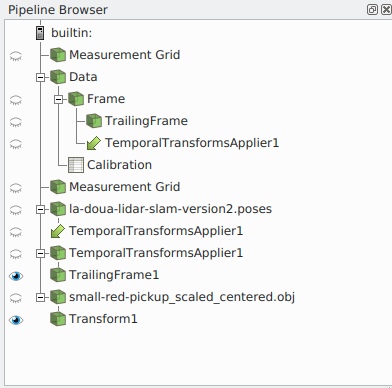

# Animations in Python

Instructions on how to generate LidarView animations with Python.

-  **temporal animations** are animations that depend on the data.  
They require providing the data trajectory as an input.  
The only supported animation mode is "Snap To Timesteps".  
**example_temporal_animation.py** provides an exemple of how to use it.

- **non-temporal animations** are simpler animations, moving the camera but not updating the 
pipeline time. It also works on non-temporal data. 
**example_non_temporal_animation.py** provides an example of how to use it.


## Requirements
In order to use temporal animations, (ie. for camera paths depending on the data trajectory),
`scipy` must be installed on the python used by LidarView.


## Relevant modules

### lib/camera_path.py

This module contains the classes which define basic camera paths. Currently, the following type of camera are implemented:
  - first person view
  - third person view 
  - absolute position
  - absolute orbit
  - relative orbit

### lib/temporal_animation_cue_helpers.py  
This module contains helper functions in order to create temporal animation scripts to use with smp.PythonAnimationCue()

When setting up a `smp.PythonAnimationCue()`, one must provide a python script containing the following methods as shown in [this doc](https://trac.version.fz-juelich.de/vis/wiki/Examples/ParaviewAnimating):

```python
import paraview.simple as smp
def start_cue(self):
    """Function called at the beginning of the animation """
    ...

def tick(self):
    """Function called at each time step of the animation """
    ...

def end_cue(self):
    """Function callerd at the end of the animation """
    ...
```

This module provides tools to help defining such methods in the case of temporal data following
a trajectory (see documentation in that file for more details).


## Tutorial

The following provides steps to use **temporal_animation_cue_helpers.py** and **camera_path**
to add a temporal animation to LidarView.
This will require a python script to be manually copy/pasted to the lidarview interface or
provided as a string property to a `smp.PythonAnimationCue()` object.

### How to define an animation cue script with `temporal_animation_cue_helpers`


### How to set the position / up_vector / focal_point ... values for the different cameras


### How to add it to lidarview animations

In a python script:

- Define a Lidarview processing pipeline

- Make sure the trajectory and the data have a similar time base.
To do so, you might need to update the trajectory with a timeshift

Example: 

```python
# Correct trajectory with lidar timesteps (which are the same as view timesteps)
# to have a common time base
correctedTraj = smp.PythonCalculator(
    Input=trajectoryReader,
    Expression='Time + {}'.format(-timeshift),
    ArrayName='Time'
)
```

- Select what you want to show in the animation

Example

```python
# show data in view
dataDisplay = smp.Show(threshold1, renderView1)
trajectoryDisplay = smp.Show(correctedTraj, renderView1)

categoryLut = cmt.colormap_from_categories_config(categoriesConfigPath)
smp.ColorBy(dataDisplay, ('POINTS', 'category'))


``` 

- Set up the animation

```python
# Create an animation cue with temporal_animation_cue_helpers
anim_cue = smp.PythonAnimationCue()
anim_cue.Script = """
import temporal_animation_cue_helpers as tach
import camera_path as cp
from scipy.spatial.transform import Rotation

# variables setup
tach.trajectory_name = "trajectory"
tach.cad_model_name = "{0}"
tach.frames_output_dir = "{1}"
cp.R_cam_to_lidar = Rotation.from_euler('ZYZ', [17, 90.0, -90.0], degrees=True)

# temporal cue creation
from temporal_animation_cue_helpers import tick, end_cue

def start_cue(self):
    tach.start_cue_generic_setup(self)
    c1 = cp.FirstPersonView(self.i, self.i+40, focal_point=[0, 0, 1])
    c2 = cp.FixedPositionView(self.i+40, self.i+100)
    c2.set_transition(c1, 5, "s-shape")		# transition from c1
    c3 = cp.AbsoluteOrbit(self.i+100, self.i+200,
            center=[99.65169060331509, 35.559305816556, 37.233268868598536],
	    up_vector=[0, 0, 1.0],
	    initial_pos = [85.65169060331509, 35.559305816556, 37.233268868598536],
	    focal_point=[99.65169060331509, 35.559305816556, 7.233268868598536])
    c3.set_transition(c2, 20, "s-shape")

    c4 = cp.ThirdPersonView(self.i+200, self.i+280)
    c4.set_transition(c3, 20, "s-shape")

    c5 = cp.RelativeOrbit(self.i+280, self.i+350, up_vector=[0, 0, 1.0], initial_pos = [0.0, -10, 10])
    c5.set_transition(c4, 20, "square")

    self.cameras = [c1, c2, c3, c4, c5]

""".format(cadModelName, framesOutDir)

# Set animation times
animation = smp.GetAnimationScene()
animation.Cues.append(anim_cue)
animation.PlayMode = 'Snap To TimeSteps'
timesteps = animation.TimeKeeper.TimestepValues
nFrames = len(timesteps)

animation.StartTime = timesteps[max(0, animation_start_time)]
animation.EndTime = timesteps[min(nFrames-1, animation_end_time)]


```


- Play the animation

```python

# ---- Play the animation
animation.Play()

```


### Inside a python script
- Define your pipeline in the python script, 


#### Using lidarview GUI
- Define your pipeline in the `Pipeline Browser` pane.

Example:



- Open the `Animation` pane, choose the 'Snap to timesteps' mode


- Double-click on the `Python` button in the animation table if it has automatically been added
(normal behaviour) or add a `Python` animation by selecting it in the drop-down list under the
table and clicking on `+`. This will open a pop-up window.
- Replace its content by the animation script.
- Press OK
- Run the animation with the `Play` button in the top bar

Example:


## Possibility to add a cad model
Note that a Transform is added after the CAD 3D model because the model is moved by the script to follow the trajectory.


