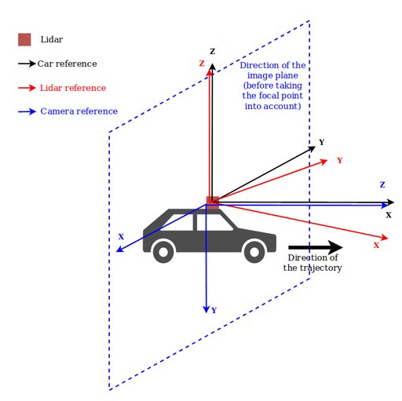
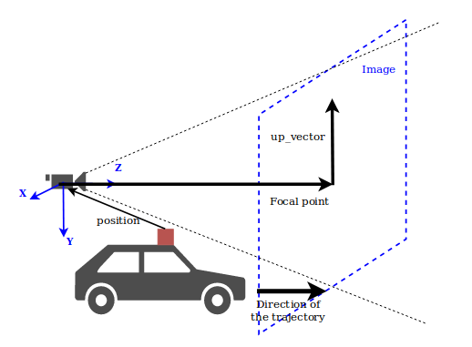
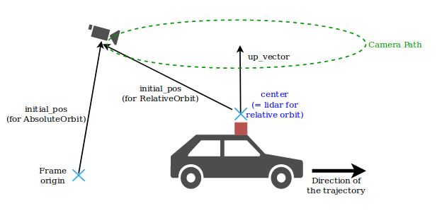
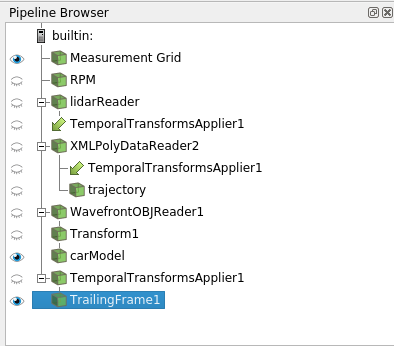
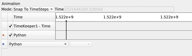
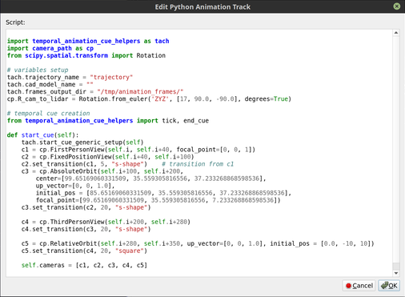

# Animations in Python

Instructions on how to generate LidarView animations with Python.

-   **temporal animations** are animations that depend on the data flow. They increment the pipeline time at each step and require providing a trajectory input which is used to move the camera reference at each step. For this reason, the only supported animation mode is "Snap To Timesteps". The script **example_temporal_animation.py** provides an exemple of how to use it.

-   **non-temporal animations** are simpler animations, moving the camera but not updating the pipeline time. The camera moves in a "frozen" version of the data.
This kind of animation works on both data with and without timesteps. The script **example_non_temporal_animation.py** provides an example of how to use it.

This README file focuses on **temporal animations**. Non-temporal animations make use of the same CameraPaths objects but require less work (hence understanding how temporal animations work should make it easy to use non-temporal ones).

This file contains:
- Software requirements (pyhon modules)
- Relevant modules (which are part of LidarView)
- A Tutorial


## Requirements

In order to use temporal animations, (ie. for camera paths depending on a trajectory),
`scipy` must be installed on the python used by LidarView.
(run `pip install scipy` on Linux or Osx)

## Relevant modules

### lib/camera_path.py

This module contains the classes which define basic camera paths. Currently, the following types of camera are implemented:
  - Views that are defined in the scene reference:
    - fixed position view: the scene is viewed from a constant point in the scene reference, fixed compared to the background,
    - absolute orbit: the scene is viewed following an orbit around a point of the scene reference,
  - Views that are defined in the car/lidar reference:
    - first person view: the scene is viewed from the vehicle (ie. the current point in the trajectory),
    - third person view: the scene is viewed from a constant point relative to the vehicle (ie. to the trajectory),
    - relative orbit: the scene is viewed following an orbit around the vehicle in its reference (ie. around the current point of the trajectory)

### lib/temporal_animation_cue_helpers.py
This module contains helper functions in order to create temporal animation scripts to use with `smp.PythonAnimationCue()`

```python
import paraview.simple as smp
def start_cue(self):
    """Function called at the beginning of the animation """
    ...

def tick(self):
    """Function called at each time step of the animation """
    ...

def end_cue(self):
    """Function callerd at the end of the animation """
    ...
```

The smp.PythonAnimationCue() object requires this python script to be manually copy/pasted to the LidarView interface or provided as its animation.Script property (as a string).
Check [this doc](https://trac.version.fz-juelich.de/vis/wiki/Examples/ParaviewAnimating) for reference


This module provides tools to help defining such methods in the case of temporal data following
a trajectory (see documentation in that file for more details).

______

## Tutorial

The following provides steps to use **temporal_animation_cue_helpers.py** and **camera_path.py**
to add a temporal animation to LidarView.
This will require a python script to be manually copy/pasted to the lidarview interface or
provided as a string property to a `smp.PythonAnimationCue()` object.


### How to define an animation cue script with `temporal_animation_cue_helpers`

An animation cue script is meant to be provided to a `PythonAnimationCue`.
The usage of `PythonAnimationCue` is explained further down in this file.

**temporal_animation_cue_helpers** provides some helpers functions in order to generate
`start_cue` / `tick` / `end_cue` for temporal data with a trajectory using minimal code:
- `start_cue_generic_setup`
- `tick`
- `end_cue`

Some of the module parameters can/must be overridden to correspond to your actual setup:
- `trajectory_name`: the name of the element of the pipeline that serves for trajectory
(it must contain `Time` and `Orientation(AxisAngle)` for each point)
- `cp.R_cam_to_lidar`: the rotation between the lidar reference and the camera reference, see below for more details on how to set it. (it is actually a parameter of camera_path)
- `frames_output_dir`: directory where you save the output screenshots
- `cad_model_name` (optional): the name of the element of the pipeline that serves for
the 3D model to place at the current trajectory point for each frame.


#### `start_cue_generic_setup`

This method runs generic setup steps at cue start.
It is intended to be run inside a `start_cue` before the camera definition step.

The different steps it runs are:
- getting the trajectory
- getting the frames orientations from trajectory
- (optional) getting a 3D model (for example a car model to add to the frame display)
- setting the start timestep

The only setup left to do is the camera path, which can be composed of:
- `CameraPath` objects (FirstPersonVew, ThirdPersonView, ...). See below for hints on how to set their parameters
- Transitions between those objects following this model:

```python
current_camera.set_transition(former_camera, interpolation_type)
# interpolation type can be: linear, square, s-shape
```

Example:
```python
    def start_cue(self)
        tach.start_cue_generic_setup(self)
        c1 = ThirdPersonView(...)
        c2 = FistPersonView(...)
        c2.set_transition(c1, 's-shape')
        self.cameras = [c1 c2]
```


#### `tick`

This method runs the following steps at each timestep:
- get the current orientation and position from the trajectory
- move the camera according to that and the CameraPath defined for the current timestep
- move the 3D model
- save the current frame

As a `PythonAnimationCue` script expects a `tick` function with only a `self`
argument, this function can be either directly used with its default keyord arguments
or wrapped in another function that provides its keyord arguments.

Example:
```python
    import temporal_animation_cue_helpers as tach
    def tick(self):
        tach.tick(self, filenameFormat="...", imageResolution=(1902, 1080))
```

#### `end_cue`
This method only prints that the animation is finished. It can be used directly with an import.

Example:

```python
    from temporal_animation_cue_helpers import end_cue
```

#### Example
Here is an example of a full `PythonAnimationCue` script.
See **example_temporal_animation.py** for an example in context.

```python
import temporal_animation_cue_helpers as tach
import camera_path as cp

tach.trajectory_name = "your-trajectory"
tach.cad_model_name = "your-model"
cp.R_cam_to_lidar = Rotation.from_euler("XYZ", [0, 90, -90], degrees=True)
tach.frames_output_dir = "/your/ouptut/dir"

def start_cue(self):
    tach.start_cue_generic_setup(self)
    c1 = cp.FirstPersonView(...)
    c2 = cp.FixedPositionView(...)
    c2.set_transition(c1, 5, "s-shape")
    self.cameras = [c1, c2]

# tick and end_cue methods don't depend on the camera path so they can
# be directly imported from the temporal_animation_cue_helpers module
# if they are used with their default keyword parameters

from temporal_animation_cue_helpers import tick, end_cue
```

### How to set the parameters (position, up_vector, focal_point, ...) for the different camera paths

- `AbsoluteOrbit` and `FixedPositionView` are camera paths that are not relative to the
trajectory, hence they expect absolute parameters (with coordinates in the fix reference of the view)

- ThirdPersonView, FirstPersonView and RelativeOrbit expect coordinates that are relative to the trajectory, so they expect coordinates in the camera reference
(ie. the reference of the current lidar frame, rotated by R_cam_to_lidar)

#### How to set R_cam_to_lidar

R_cam_to_lidar is the rotation between the camera frame and the lidar frame.
The camera has to be set with X, Y forming the image plane, and Z pointing in the field of view of the image.

Example:

In the following case (from dataset-la-doua), the Z axis of the lidar is vertical, but X doesn't point to the front of the car, `R_car_to_lidar` should be set to something like:

```python
cp.R_cam_to_lidar = Rotation.from_euler('ZYZ', [17, 90.0, -90.0], degrees=True)
```

Which is composed of:
- a rotation of 17 deg around Z to compensate for the lidar-trajectory angle
- a rotation of [0, 90.0, -90.0] to pass from Z in the front (camera ref) to X in the front (lidar ref)




#### How to set the camera path parameters

- `position`: position of the camera, either
    - in the frame reference for absolute camera paths
    - in the camera reference, with the lidar position as origin for relative camera paths
- `focal point`: focal point of the camera in the camera reference (where the camera is pointing to)
- `up vector`: direction of the top of the image.




Specific to orbits:
- `initial_pos`: initial position of the camera (similar to `position`)
- `up_vector`: rotation axis
- `center`: center of rotation
- `ccw`: boolan, decides the direction direction (counter-clock-wise by default)



Specific to FixedPositionView:
    - `position` is by default to None, in which case it takes the current position
    - `focal_point` is by default to None, in which case it uses the lidar position


### Tips

#### How to generate a pseudo first person view from the top of a car model:

```python
    c1 = cp.ThirdPersonView(self.i, self.i+40, focal_point=[0, 0, 20], position=[0, -1.7, -3.5])
```

This enable being slightly behind and on top of the car and see the front of it in the view

#### How to add, scale and center a 3D car model:
(the values for this example are valid for dataset-la-doua)
- Add a cad model reader
- add a transform to make the model look foreward in the lidar reference
- add a second transform to let the camera_animation_cue move the car with the trajectory.

Example:

```python
carModelPath = '/path/to/your/3D/models/small-red_pickup.obj'
carModelRotation = [90, 90 + 17, 0]
# [90, 90, 0] to compensate the model orientation
# + [0, 17, 0] to compensate the lidar orientation to the front of the car
carModelScale = [0.05] * 3
carModelTranslation = [0, 0, -1.5]  # this lets the car lie on the floor

if not carModelPath:
    carModel = None
else:
    carModelSource = WavefrontOBJReader(FileName=carModelPath)
    # Scale and center the model
    carModelTmp = smp.Transform(Input=carModelSource)
    carModelTmp.Transform.Scale = carModelScale
    carModelTmp.Transform.Translate = carModelTranslation
    carModelTmp.Transform.Rotate = carModelRotation

    # Add a transform to enable the script to move the car model
    carModel = smp.Transform(Input=carModelTmp)
```

## How to add it to lidarview animations

### Using a python script

- Define a LidarView processing pipeline
- Make sure the trajectory and the data have a similar time base
- Select what you want to show in the animation
- Setup the animation
- Play the animation

#### Define a Lidarview processing pipeline

See example_temporal_animation.py for an example.

#### Make sure the trajectory and the data have a similar time base.
To do so, you might need to update the trajectory with a timeshift

Example:

```python
# Correct trajectory with lidar timesteps (which are the same as view timesteps)
# to have a common time base
correctedTraj = smp.PythonCalculator(
    Input=trajectoryReader,
    Expression='Time + {}'.format(-timeshift),
    ArrayName='Time'
)
```

#### Select what you want to show in the animation

Example:

```python
# show data in view
dataDisplay = smp.Show(threshold1, renderView1)
trajectoryDisplay = smp.Show(correctedTraj, renderView1)

categoryLut = cmt.colormap_from_categories_config(categoriesConfigPath)
smp.ColorBy(dataDisplay, ('POINTS', 'category'))


```

#### Set up the animation

```python
# Create an animation cue with temporal_animation_cue_helpers
anim_cue = smp.PythonAnimationCue()
anim_cue.Script = """
import temporal_animation_cue_helpers as tach
import camera_path as cp
from scipy.spatial.transform import Rotation

# variables setup
tach.trajectory_name = "trajectory"
tach.cad_model_name = "{0}"
tach.frames_output_dir = "{1}"
cp.R_cam_to_lidar = Rotation.from_euler('ZYZ', [17, 90.0, -90.0], degrees=True)

# temporal cue creation
from temporal_animation_cue_helpers import tick, end_cue

def start_cue(self):
    tach.start_cue_generic_setup(self)
    c1 = cp.FirstPersonView(self.i, self.i+40, focal_point=[0, 0, 1])
    c2 = cp.FixedPositionView(self.i+40, self.i+100)
    c2.set_transition(c1, 5, "s-shape")		# transition from c1
    c3 = cp.AbsoluteOrbit(self.i+100, self.i+200,
            center=[99.65169060331509, 35.559305816556, 37.233268868598536],
	    up_vector=[0, 0, 1.0],
	    initial_pos = [85.65169060331509, 35.559305816556, 37.233268868598536],
	    focal_point=[99.65169060331509, 35.559305816556, 7.233268868598536])
    c3.set_transition(c2, 20, "s-shape")

    c4 = cp.ThirdPersonView(self.i+200, self.i+280)
    c4.set_transition(c3, 20, "s-shape")

    c5 = cp.RelativeOrbit(self.i+280, self.i+350, up_vector=[0, 0, 1.0], initial_pos = [0.0, -10, 10])
    c5.set_transition(c4, 20, "square")

    self.cameras = [c1, c2, c3, c4, c5]

""".format(cadModelName, framesOutDir)

# Set animation times
animation = smp.GetAnimationScene()
animation.Cues.append(anim_cue)
animation.PlayMode = 'Snap To TimeSteps'
timesteps = animation.TimeKeeper.TimestepValues
nFrames = len(timesteps)

animation.StartTime = timesteps[max(0, animation_start_time)]
animation.EndTime = timesteps[min(nFrames-1, animation_end_time)]


```


#### Play the animation

```python

# ---- Play the animation
animation.Play()

```

### Using lidarview GUI
- Define your pipeline in the `Pipeline Browser` pane.

Example:



- Open the `Animation` pane, choose the 'Snap to timesteps' mode



- Double-click on the `Python` button in the animation table if it has automatically been added
(normal behaviour) or add a `Python` animation by selecting it in the drop-down list under the
table and clicking on `+`. This will open a pop-up window.
- Replace its content by the animation script.
- Press OK
- Run the animation with the `Play` button in the top bar

Example:




