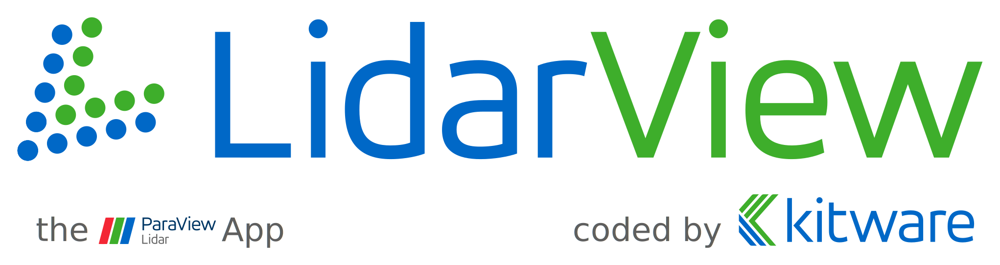

# Introduction
LidarView performs real-time visualization 3D LiDAR data
from Velodyne's HDL sensors (HDL-32E and HDL-64E).

LidarView can display live sensors' streams or playback pre-recorded data stored in .pcap files.

The HDL sensors sweeps an array of lasers (32 or 64) 360&deg; and a vertical field of
view of 40&deg;/26&deg; with 5-20Hz and captures about a million points per
second (HDL-32E: ~700,000pt/sec; HDL-64E: ~1.3Million pt/sec).

LidarView displays the distance measurements from the HDL as point cloud
data and supports custom color maps of multiple variables such as
intensity-of-return, time, distance, azimuth, and laser id. 

The data can
be exported as XYZ data in CSV format or screenshots of the currently
displayed point cloud can be exported with the touch of a button.

As a [Paraview](https://www.paraview.org/) based application, LidarView can effortlessly offer Paraview's features and plugins.

# Features

-   Input from live sensor stream or recorded .pcap file
-   Visualization of 3D timed LiDAR returns in 3D
-   Spreadsheet inspector for LiDAR attributes (timestamp, azimuth, laser id, etc)
-   Record to .pcap from sensor
-   Export to CSV or VTK formats
-   Record and export GPS and IMU data 
-   Grid and Ruler tools 
-   Visualize GPS data paths
-   Show multiple frames of data simultaneously 
-   Show or hide lasers subsets

# How to Get
Lidarview has been tested on the following platforms:

* Ubuntu  18
* Windows x64
* MacOS 10.10

It may be possible to build under Ubuntu 20, provided that Qt5.10 is built from source and other details taken care of.

## Binary Releases - LidarView v1.4.1

### Linux ([Download Link](http://www.example.org))

Dependencies:

* Qt5.12 - [Installer](http://download.qt.io/official_releases/qt/5.12/5.12.10/qt-opensource-linux-x64-5.12.10.run)

### Windows x64 ([Download Link](http://www.example.org))

Dependencies:

* Qt5.12 - [Installer](http://download.qt.io/official_releases/qt/5.12/5.12.10/qt-opensource-windows-x86-5.12.10.exe)

### MacOS ([Download Link](http://www.example.org))

Dependencies:

* Qt5.12 - [Installer](http://download.qt.io/official_releases/qt/5.12/5.12.10/qt-opensource-mac-x64-5.12.10.dmg)

## Build from source

Part of the LidarView application lies within the [LVCore](LVCore) repository.

Detailed Instructions to build and package LidarView are available under *`LVCore/Documentation/LidarView_Developer_Guide.md`*.

# How to use

## Sensor Streaming
Specific network configuration is required for sensor livestream, the Ethernet adapter
connected to the sensor has to be switched from dynamic IP address assignment to static IP address
selection and choose:

* HDL-32E
  * IP address: 192.168.1.70 (70 as example, any number except 201 works)
  * Gateway: 255.255.255.0
* HDL-64E
  * IP address: 192.168.3.70 (70 as example, any number except 43 works)
  * Gateway: 192.168.3.255

In order for sensor streaming to work properly, it is important to
disable firewall restrictions for the chosen Ethernet port and allow inbound traffic.
Alternatively, completely disable the firewall for the ethernet device connected to the sensor (including both public
and private networks).

When opening pre-recorded data or live sensor streaming data one is
prompted to choose a calibration file.

* For HDL-32E data no calibration
file is needed (the HDL-32E calibration values are already embedded in LidarView) therefore select "NONE".
* For HDL-64E data the correct
calibration file for that sensor needs to be chosen. The calibration
file can be found on the individual product CD that was provided with the
HDL-64E sensor.

# Sample Data
Sample data for LidarView can be obtained from:

* [MIDAS](http://www.midasplatform.org/) in the [Velodyne LiDAR collection](http://midas3.kitware.com/midas/community/29)

# License
The source code for LidarView is made available under the Apache 2.0 license.

See [LICENSE](LICENSE).
