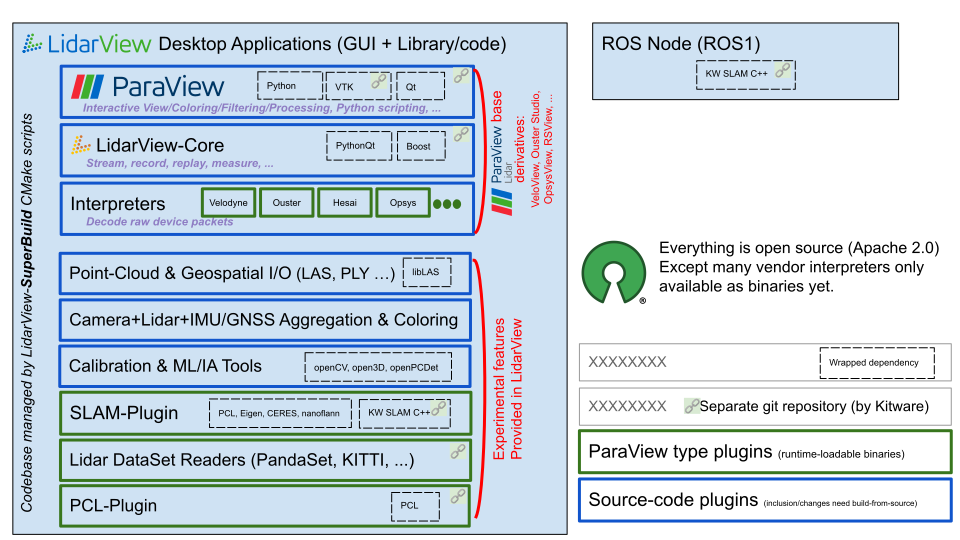

# Introduction

LidarView performs real-time reception, recording, visualization and processing of 3D LiDAR data.

LidarView's open source codebase developed by Kitware is used by many different applications to display live LiDAR data from
Velodyne, Ouster, Opsys, Lumotive, RoboSense, Hesai, LeiShen LS Lidar, and more.

This open-source declination only supports VeloDyne's open-source interpreters: VLP-16, VLP-32, HDL-32, HDL64, Alpha Prime.

Many of these LiDAR sensors sweep an array of lasers (often 8 to 128) 360&deg;
with a vertical field of view of tens of degrees at a 5-20Hz spinning frequency,
capturing about a million points per second.

LidarView can display live sensors' streams or playback pre-recorded data stored in `.pcap` files.

LidarView displays the distance measurements from the LiDAR as point cloud
data and custom color maps for multiple variables such as
intensity-of-return, time, distance, azimuth, and laser id. 

The processed data can be exported in multiple file formats (CSV, PLY, LAS, ...),
and screenshots of the currently displayed point cloud can be easily exported with the help of a button.

As a [Paraview](https://www.paraview.org/) based application, LidarView can effortlessly offer Paraview's features and plugins.

    Lidar data processed by [Kitware's SLAM](#slam) within LidarView

# Features

- Input from live sensor stream or recorded `.pcap` file
- Visualization of timestamped LiDAR returns in 3D
- Spreadsheet inspector for LiDAR attributes (timestamp, azimuth, laser id, etc)
- Record to `.pcap` from sensor
- Export to CSV, PLY, PCD, LAS or VTK formats
- Record and export GPS and IMU data
- Visualize GPS data paths
- Grid and Ruler tools
- Show or hide lasers subsets
- Show multiple frames of data simultaneously and aggregate them
- Apply 3D transforms to pointclouds
- Run SLAM to estimate the trajectory of the LiDAR in the scene and build a 3D map of the environment

Many other features can be added using Plugins, some can be found on [this page](https://gitlab.kitware.com/LidarView/plugins). They enable for example to:
- run Deep Learning models for object detection on your point cloud (see [this repo](https://gitlab.kitware.com/LidarView/plugins/lidarviewdeeplearningplugins))
- read data from the PandaSet dataset (see [this repo](https://gitlab.kitware.com/LidarView/plugins/pandasetplugin))
- more features to come

Feel free to reach out at kitware@kitware.com for support or new features development.

# How to get

Lidarview is maintained on the following platforms:

* Ubuntu 18, Ubuntu 20
* Windows x64
* MacOS 10.10

See detailed general installation instructions on the [`LVCore/Documentation/INSTALLATION.md`](https://gitlab.kitware.com/LidarView/lidarview-core/-/blob/master/Documentation/INSTALLATION.md) page.

See the Detailed installation instructions for the current and older releases on the [RELEASES.md](RELEASES.md) page.

See associated download links in the [Release](https://gitlab.kitware.com/LidarView/lidarview/-/releases) page of this repository.

## Build from source

Most of the LidarView common codebase lies within:

 * [LVCore](LVCore) repository.
 * [LidarView-superbuild](Superbuild/lidarview-superbuild) repository.

Detailed Instructions to build and package LidarView are available under [`LVCore/Documentation/LidarView_Developer_Guide.md`](https://gitlab.kitware.com/LidarView/lidarview-core/-/blob/master/Documentation/LidarView_Developer_Guide.md).

# How to use

## Sensor streaming

Specific network configuration is required for sensor livestream.
The ethernet adapter connected to the sensor has to be switched from dynamic IP address assignment to static IP address selection and correct IP adress and gateway must be specified.

For example:

* Velodyne HDL-32E
  * IP address: 192.168.1.70 (70 as example, any number except 201 works)
  * Gateway: 255.255.255.0
* Velodyne HDL-64E
  * IP address: 192.168.3.70 (70 as example, any number except 43 works)
  * Gateway: 192.168.3.255

In order for sensor streaming to work properly, it is important to
disable firewall restrictions for the chosen ethernet port and allow inbound traffic.
Alternatively, completely disable the firewall for the ethernet device connected to the sensor (including both public and private networks).

When opening pre-recorded data or live sensor streaming data,
one is prompted to choose a calibration file.
This calibration can either be directly embedded in LidarView,
or may be loaded from a custom location.

## SLAM documentation 

More [instructions](https://gitlab.kitware.com/keu-computervision/slam/-/blob/master/paraview_wrapping/doc/How_to_SLAM_with_LidarView.md) can be found on the [LidarSlam repository](https://gitlab.kitware.com/keu-computervision/slam).

Have a look also at the [How to SLAM with LidarView](https://vimeo.com/524848891) webinar.

# Sample data

LiDAR data samples for LidarView can be obtained from:

* [MIDAS](http://www.midasplatform.org/) in the [Velodyne LiDAR collection](http://midas3.kitware.com/midas/community/29)
* Kitware's demos shared [drive](https://drive.google.com/drive/folders/1yrNUelUsjKcXdC8FH8DpXeOPTyiB_pLS?usp=sharing)

# For Github users
[Github](https://github.com/Kitware/LidarView) is a mirror of the
[official repository](https://gitlab.kitware.com/LidarView/LidarView).
We do not actively monitor issues or pull request on Github. Please use the
[official repository](https://gitlab.kitware.com/LidarView/LidarView) to report issues or contributes fixes.

# License

The source code for LidarView is made available under the Apache 2.0 license.

See [LICENSE](LICENSE).
