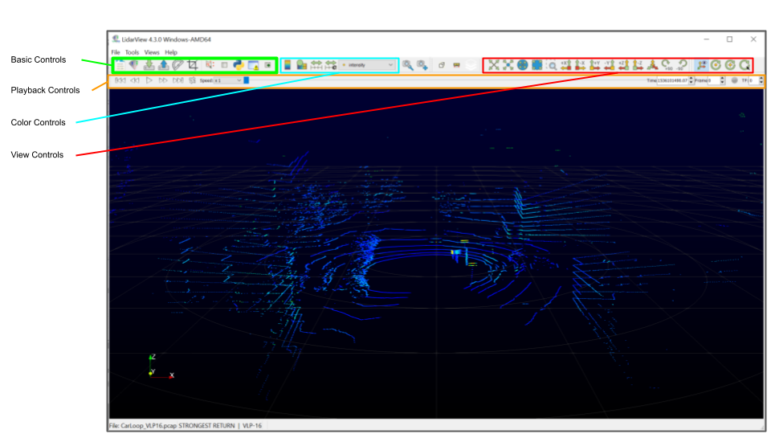
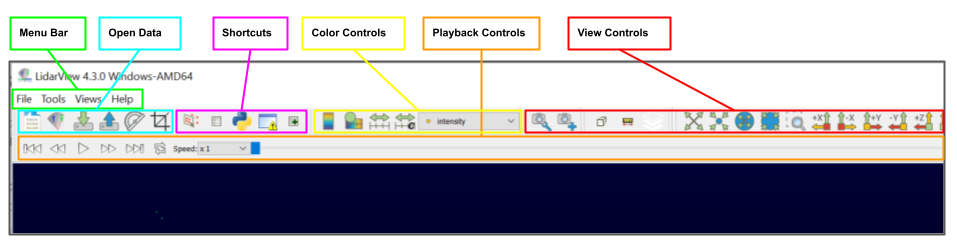

.. _chapter:BasicUsage:

Basic Usage
###########

Let us get started using **LidarView**. In order to follow along, you will
need your own installation of **LidarView**. If you do not already have **LidarView**,
you can download the current release of LidarView_.
**LidarView** launches like most other applications. On Windows, the
launcher is located in the start menu. On Macintosh, open the
application bundle that you installed. On Linux, execute ``LidarView`` from a
command prompt (you will need to set your path to point to where you unpacked
LidarView).

User Interface
==============

The **LidarView** GUI conforms to the platform on which it is running, but on
all platforms it behaves basically the same. The layout shown here is
the default layout given when **LidarView** is first started. The GUI
includes a Menu Bar as well as a Tool Bar that give access to the various
features of the application.

Menu Bar
    This gives access to File related options like opening PCAP files and
    sensor streams, a Tools and View menu, and a general Help menu.

The Tool Bar can be broked up into several separate sections described below.

Open Data Toolbar
    This part of the toolbar includes buttons to manage opening PCAP files and
    sensor streams, loading and saving **LidarView** state files, and importing
    calibration files.

Shortcuts Toolbar
    This section of the toolbar gives quick access to the spreadsheet view and
    the python and error consoles as wells as the ability to selects points from
    the current active data.

Playback Controls
    These controls allow the user to temporally navigate the Lidar data. The
    data can be played through, advanced one frame at a time, or a specific
    time can be selected.

Color Controls
    These controls allow the user to select what data field determines how the
    point cloud is colored and adjust the color map used to represent the range
    of the selected data field.

View Controls
    These controls allow the user to set the prespective that the point cloud is
    viewed from.

Opening PCAP File
=================

There are two ways to get Lidar data into LidarView. You can connect to a sensor
steam or open a recorded sensor stream saved to a PCAP file. To open a PCAP file
into LidarView click on the Open PCAP File button |OpenPCAP| in the Open Data
section of the toolbar, select the PCAP file you wish to open and click
OK, and then select the appropriate sensor interpeter and click OK. You should
now see the first frame of the saved sensor data displayed in the main render
view. If you do not have access to a PCAP with sensor data you can download an
example: CarLoop_VLP16_.

.. |OpenPCAP| image:: ../Application/Ui/Widgets/images/WiresharkDoc-128.png
   :height: 20px

Playback Sensor Stream
======================

Now that we have loaded a saved sensor stream we can play it back. Click on the
|Play| button in the Playback Controls to have LidarView playback the sensor
stream. The playback can be paused at any time by clicking on the |Pause|
button which replaces the |Play| button while the stream is advancing.

.. |Play| image:: ../LVCore/ApplicationComponents/Icons/media-playback-start.png
   :height: 20px

.. |Pause| image:: ../LVCore/ApplicationComponents/Icons/media-playback-pause.png
   :height: 20px

.. _LidarView: https://gitlab.kitware.com/LidarView/lidarview/-/releases
.. _CarLoop_VLP16: https://drive.google.com/file/d/1eARfsQWMcAa34GBHfDOs1JQ7nazQM3Jo/view?usp=share_link>
